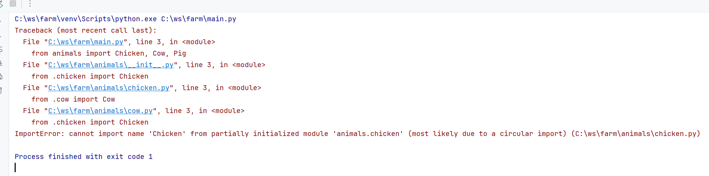

# Farm Animals Project

This project simulates interactions between various farm animals, including chickens, cows, and pigs.

## Animals

### Chicken


### Cow


### Pig


## How to Run the Program

To run the program, execute the `main.py` file:

```bash
python main.py
```

### Error Message


### Error Resolved

### Handling Circular References in the Project

In this project, circular references occurred due to interdependent imports between certain modules, specifically when **Pig** and **Chicken** relied on each other. Circular references can cause issues such as import errors or unexpected behavior because Python's import system struggles to resolve dependencies when two or more modules require each other directly.

To resolve these circular references, we adopted the following strategies:

#### **1. Delayed Imports**
Where circular references occurred (e.g., in the `interact_with_chicken` method of the `Pig` class), imports were deferred to inside the method where the dependency was required. This ensures that modules are imported only when needed and avoids prematurely triggering circular imports during module initialization.

Example of the fix:
```python
def interact_with_chicken(self):
    from .chicken import Chicken  # Import moved inside the method to delay import execution

    chicken = Chicken()
    return f"{self.name} says hi to {chicken.name} and makes a sound: {self.sound()}"
```

This approach relies on Python’s ability to dynamically import modules at runtime, bypassing the initialization issues tied to circular references.

#### **2. Naming Conflicts and Shadowing**
To avoid confusion or shadow naming (e.g., when a variable name shadows a class name in a local scope), the following changes were made:
- Local variable names were adjusted to be more explicit and descriptive, differentiating them from class names or other identifiers from imported modules.

For example, in the `interact_with_chicken` method:
```python
def interact_with_chicken(self):
    from .chicken import Chicken

    _chicken = Chicken()  # Local variable renamed for clarity
    return f"{self.name} says hi to {_chicken.name} and makes a sound: {self.sound()}"
```

This ensures that the imported classes and locally defined variables remain distinct, improving code clarity and maintainability.

#### **3. Best Practices to Prevent Circular References**
Moving forward, the following best practices were adopted to minimize the risk of circular references resurfacing in the project:
- **Modular Design**: Ensure that modules have clear responsibilities and reduce unnecessary interdependencies.
- **Dynamic Imports**: Use inline or function-level imports when dependencies are only required in specific parts of the code.
- **Refactoring Dependency Chains**: Where possible, refactor tightly-coupled components into shared utility modules to break direct cyclical dependencies.

By applying these changes, the project now avoids issues with circular references and ensures that the interdependent code works reliably without hindering maintainability.