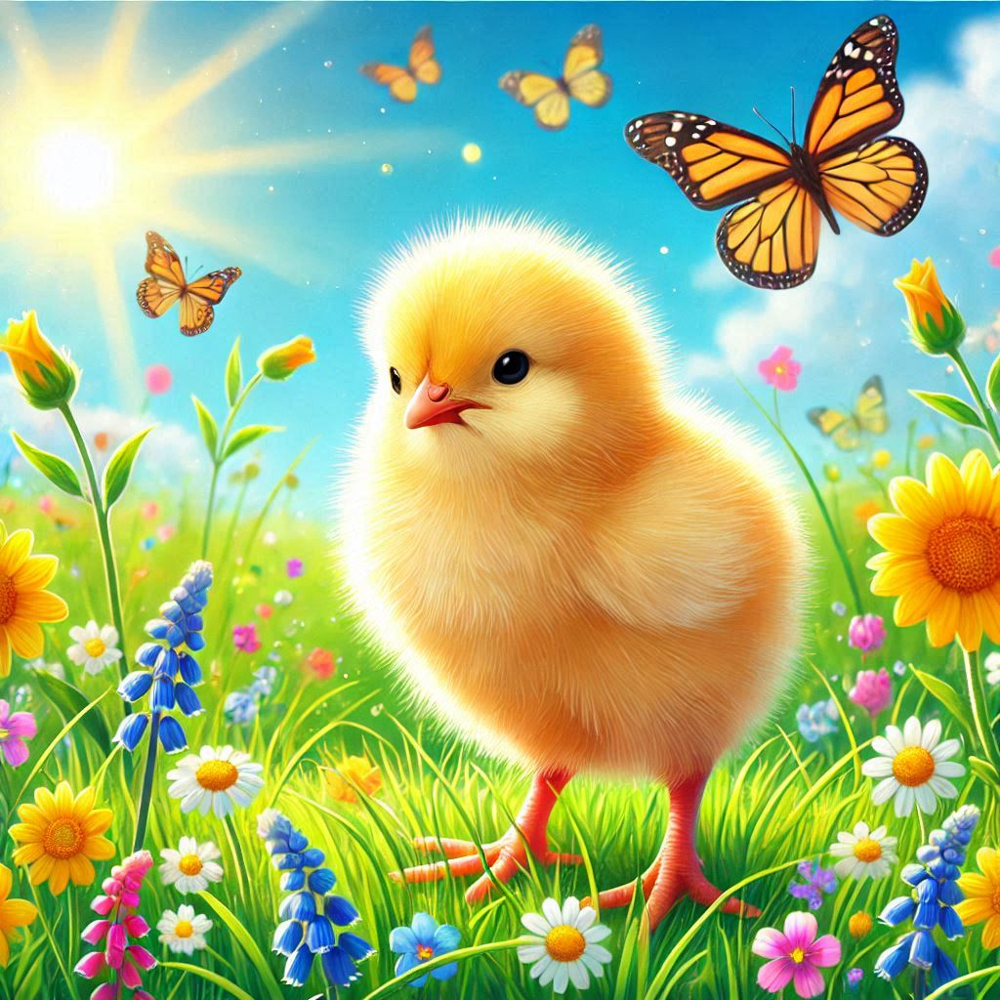
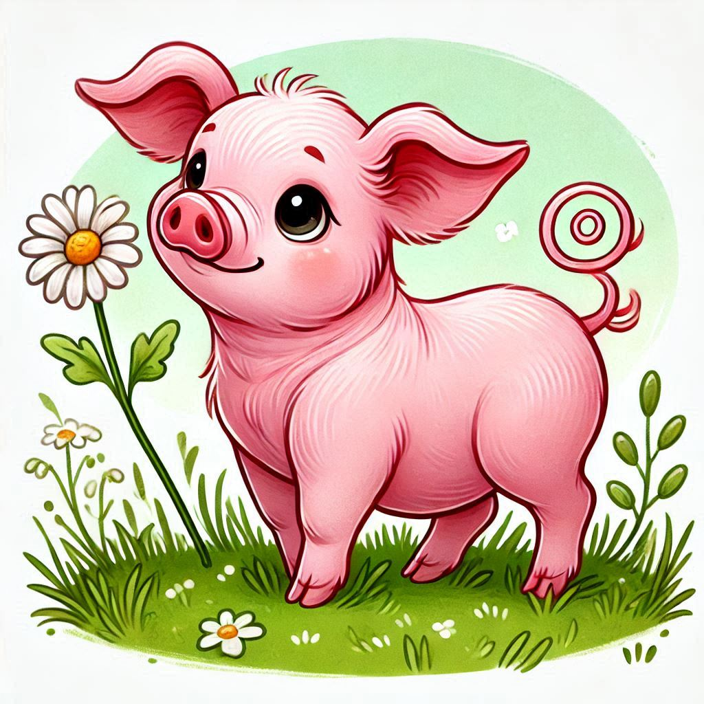

# Farm Animals Project

This project simulates interactions between various farm animals, including chickens, cows, and pigs.

## Animals

### Chicken



### Cow


### Pig


## How to Run the Program

To run the program, execute the `main.py` file:

```bash
python main.py
```

### Error Message
